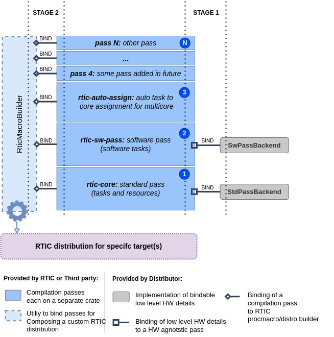

# RTIC Evolution: Multicore support, Distributions and compilations passes

**Project Objective:** 

The objective of this project is to enhance the scalability of the RTIC (Real-Time Interrupt-driven Concurrency) framework, particularly to make it flexible enough to allow for multi-core hardware configurations. The goal is to decouple the RTIC declarative model from the hardware-specific implementation details. And in addition provide a mechanism for additional syntax extension through 3rd party crates know as extra compilation passes crates. By achieving this, we aim to create a more maintainable and extensible RTIC framework capable of accommodating various hardware configurations while preserving the original core declarative model.

### How the project objectives have been achieved
The RTIC framework modularity problem can be solved like in any other software project by finding the right abstractions, and with simple software design patterns. 

- First, Decoupling the RTIC declarative model code parsing and generation from the hardware-specific details has been achieved by carefully reviewing the current RTIC codebase, identifying which parts were dependent on hardware-specific details and which parts were more generic. After doing this, It turned out that only a small portion of the code generation was hardware-specific. So, this part was taken out and replaced by dynamically linking an external type that implements some trait functions that include the hardware-specific logic. 

- The second part is about reducing the complexity of the RTIC project and making it more accessible to first-time contributors. This problem has been solved by devising an approach where the RTIC application is parsed and expanded several times. In essence, RTIC is all about having tasks that can share resources, with some of those tasks that can be bound to interrupt lines. So, a basic crate called `rtic-core` was developed to provide just that, and in addition, it provides a mechanism for stacking external logic from other crates that can turn more complex RTIC applications into something that lower level passes can understand. 

Solving those two problems lead to what is known as **RTIC distributions and External Compilation passes**

### **RTIC distributions** and External Compilation passes

An RTIC distribution is a proc-macro crate that exposes an RTIC framework **implemented for a specific hardware architecture or even for a specific micro-controller**. For example, we could have a distribution for single core cortex-m devices, another distribution specifically tailored for the RP2040, a distribution for risc-v architecture ... etc. 

Each distribution will :

- (Stage 1) Implement the **low level hardware specific** details and provide/bind that to the hardware agnostic RTIC compilation passes (code parsing, analysis and generation).
- (Stage 2) Integrate a selection of **compatible** `Compilation passes` and expose them to the user as a set of **features** which the user can select to enable.

  

- Stage 1 defines the abstractions to achieve separation between RTIC generic logic from low level hardware related details.
- Stage 2 defines abstractions to allow modularity at syntax level. Higher level compilation passes (notice numbering in the diagram above, N is highest) perform code/model transformations that lower level passes can understand.

This makes RTIC code-base growth more controllable and provides an alternative approach to the current one in which all the hardware specific details all belong to a single crate and an implementation for some specific hardware is chosen by enabling a corresponding rust feature. 

**RTIC distributions** DO NOT re-implement the RTIC framework from scratch, instead they only provide the low level / target use case specifics of the implementation to `rtic-core` library (containing the standard pass and utilities for binding other passes)  and other `compilation passes` crates/libraries that will do all the heavy lifting of parsing, analyzing and generating code.

In this experiment project

- `rtic-core` is the library crate which:

  - contains the **Hardware Tasks and Resources** pass which will be referred to as `THE STANDARD PASS`.

  - Exposes an Builder API for loading other external passes (from 3rd party crates) and for externally providing hardware specific implementations to build an RTIC framework 

- `rtic-sw-pass` is the default crate that provides a software tasks pass. It does that by simply generating the necessary queues for message passing and then declaring the dispatchers as hardware tasks. Resource management and binding to interrupts and all other initialization steps will be taken care of by the hardware pass in`rtic-core`

- `rp2040-rtic`: is an example RTIC distribution (multicore) specific to the RP2040 which defines the rp2040 specific hardware details and provides them to  `rtic-core` , `rtic-sw-pass` and other compilation passes crates to create the desired distribution.  

- other passes like monotonics and automatic task assignment to cores pass will be described here later once they are implemented

### More

- [Multicore rtic application example](rtic_mc.md)
- [Rust code documentation](https://zakimadaoui.github.io/rtic-mc-experiments/)

### Other useful links
- [single core rtic application example](rp2040-rtic/examples/hello_rtic.rs) 
- [multi-core rtic application with cross-core communication (classic ping-pong)](rp2040-rtic/examples/ping_pong.rs)  
